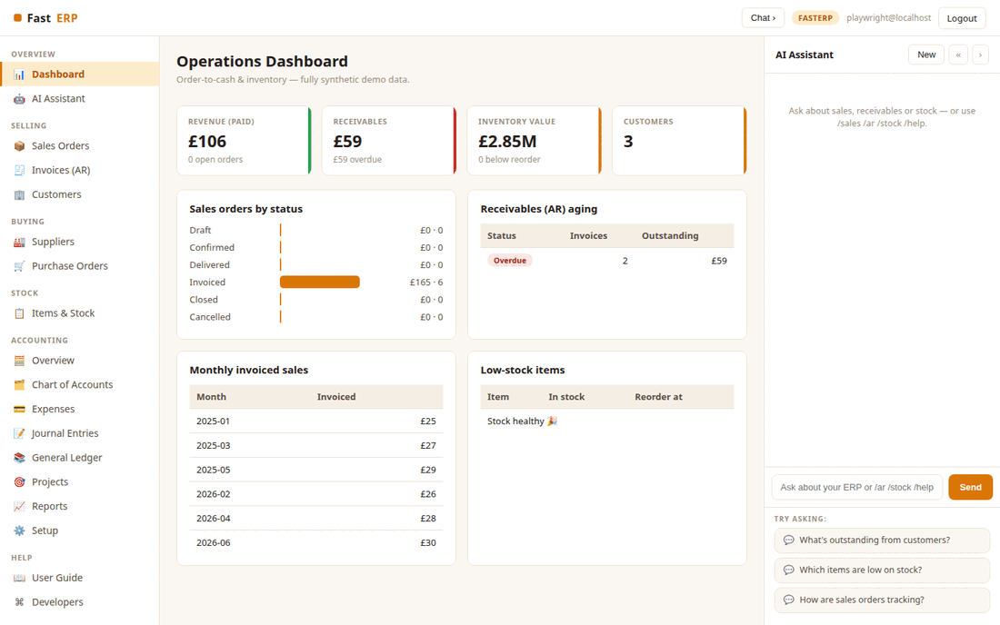

# FastERP

**FastERP** is an open-source **ERP** built with [FastHTML](https://fastht.ml) —
a server-side, HTMX-driven port of [ERPNext](https://github.com/frappe/erpnext),
scoped to the **Order-to-Cash + Inventory** vertical (ERPNext is ~527 doctypes;
FastERP models the slice an ops/finance team lives in). Python-first, no
JavaScript framework, with an AI assistant grounded in the live (synthetic) data.

*Sell, ship, invoice, get paid.* Runs on port **5011**.

> **Synthetic data only.** Everything runs on a deterministic, fully synthetic
> dataset generated by `seed.py`.

## Demo



## Quickstart (native)

```bash
python -m venv .venv
.venv/bin/python -m pip install -r requirements.txt
cp .env.sample .env          # add an LLM key for free-form AI chat
.venv/bin/python web_app.py  # http://localhost:5011  (self-seeds on first boot)
```

Login: `admin@fasterp.example` / `FastERP2026$`. Rebuild data with
`.venv/bin/python seed.py`.

## Run with Docker

```bash
docker compose up --build      # http://localhost:5011
```

`Dockerfile` (python:3.12-slim, port 5011) seeds on first boot;
`docker-compose.yml` mounts a `fasterp-data` volume at `/data`.

## Module tour

- **Dashboard** (`/`) — revenue (paid), receivables (with overdue), inventory
  value and low-stock count; sales orders by status, **AR aging**, monthly
  invoiced sales, and low-stock items.
- **Sales Orders** (`/orders`) — filter by status; open an order for its **line
  items**, totals, and linked invoice.
- **Invoices (AR)** (`/invoices`) — accounts-receivable list with outstanding
  amounts and status (Unpaid / Partly Paid / Paid / **Overdue**).
- **Items & Stock** (`/items`) — inventory by group with stock levels, value, and
  a **reorder flag**.
- **Customers** (`/customers`) — accounts ranked by outstanding balance.
- **AI Assistant** (right rail) — ops/finance Q&A grounded in a live snapshot;
  slash-commands `/sales`, `/ar`, `/stock`, `/top` work with **no API key**.

## Scope

ERPNext spans Accounting, Selling, Buying, Stock, Manufacturing, Assets,
Projects and more (~527 doctypes). FastERP deliberately models **one coherent
flow — order to cash, with the inventory that backs it**. The full module map and
what's deferred is in **[docs/ROADMAP.md](docs/ROADMAP.md)**.

## Architecture

```
web_app.py        routes, auth, SSE chat, boot
db.py             SQLite schema (selling + stock) + KPI helpers
seed.py           deterministic synthetic customers, items, orders, invoices, stock
web/layout.py     3-pane shell, CSS, chat JS
web/views.py      dashboard, orders, invoices, items, customers renderers
web/ai.py         grounded chat + slash-commands
```

See **[SKILLS.md](SKILLS.md)** for the capability reference + migration playbook.
Part of the
[`fasthtml-oss-migrations`](https://github.com/predictivelabsai/fasthtml-oss-migrations)
initiative.

## Licence

MIT.
