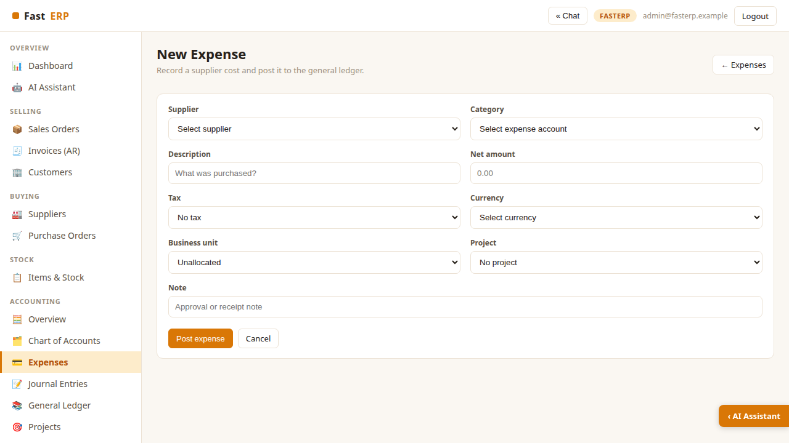
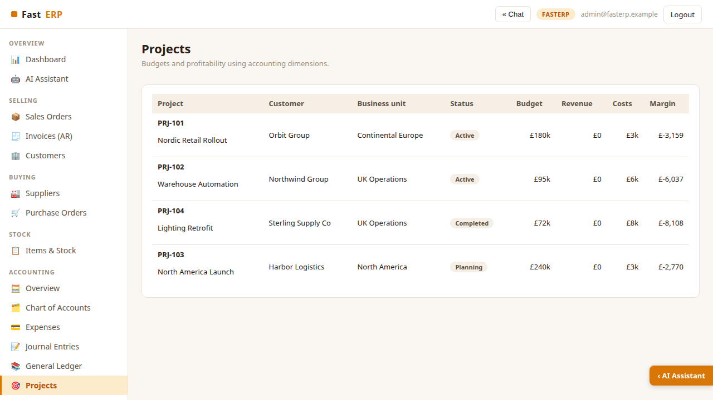
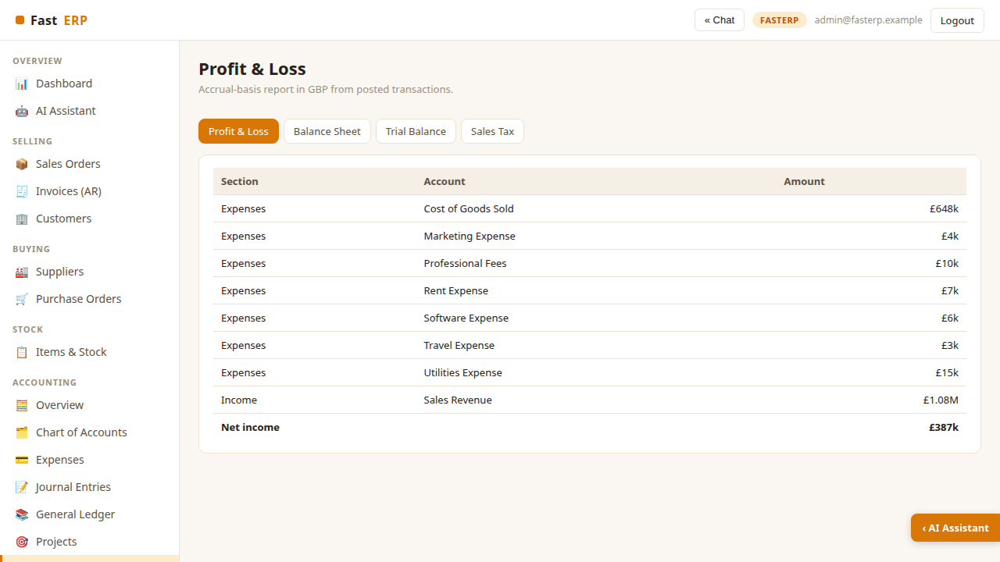
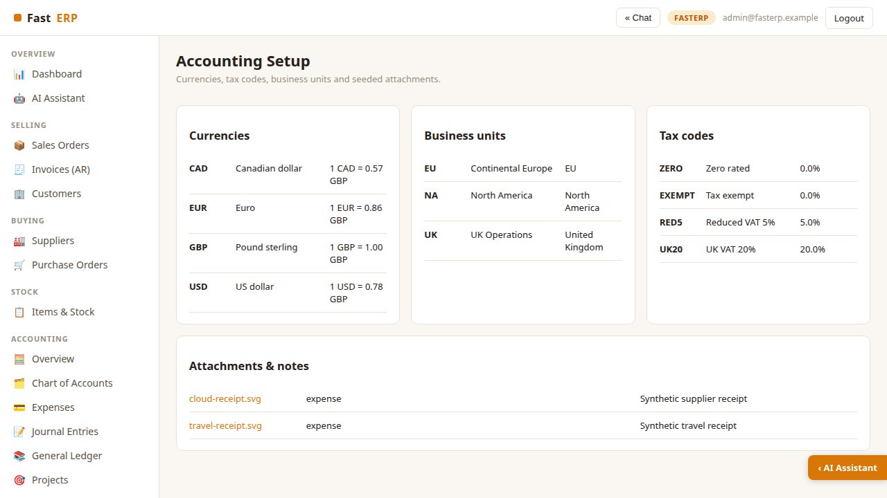
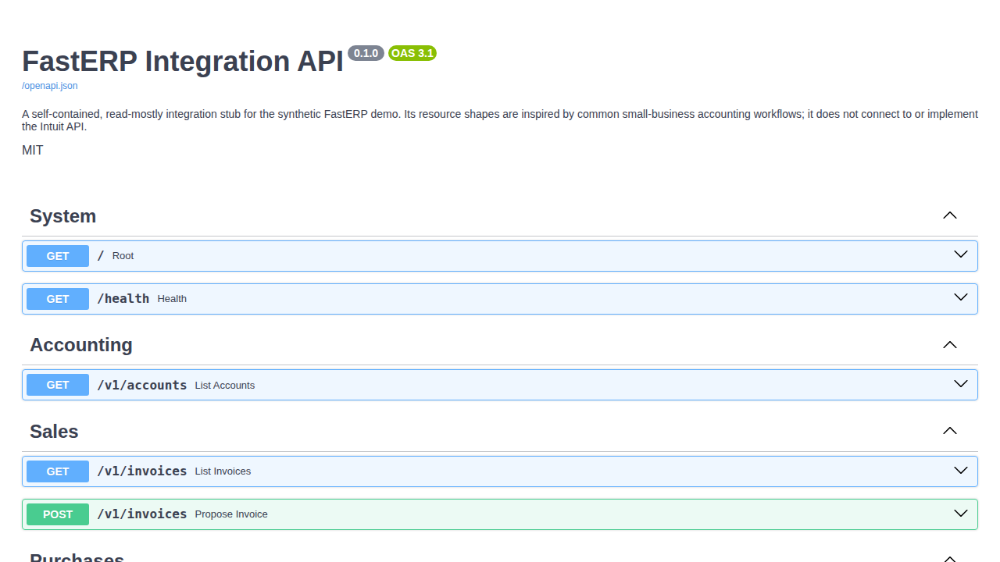

::: cover

# FastERP

#### Accounting Workspace User Guide

**Sell, ship, invoice, get paid — and keep balanced books.**

Self-contained synthetic demonstration · No Intuit connection

:::

---

## Start FastERP

```bash
python -m venv .venv
.venv/bin/python -m pip install -r requirements.txt
cp .env.sample .env
.venv/bin/python seed.py
.venv/bin/python web_app.py
```

Open `http://localhost:5011` and sign in as
`admin@fasterp.example` / `FastERP2026$`. The data is deterministic and
synthetic; rerunning `seed.py` restores the demo baseline.

The left sidebar groups Selling, Buying, Stock and Accounting. Collapse the AI
rail when you want more room for reports.

---

## Accounting overview


Open **Accounting → Overview** for the finance cockpit. The KPI row summarizes
cash and bank, receivables, payables and net income. Below it, review the current
profit-and-loss snapshot, active projects and latest ledger postings.

Use **New expense** for supplier costs and **Journal entry** for controlled
adjustments. Every posted workflow writes balanced debit and credit lines.

---

## Record a categorized expense



Choose a supplier and expense account, then enter the net amount. Select a tax
code and transaction currency; FastERP converts the posting to GBP using the
seeded rate while retaining the source currency.

Optionally assign a **business unit** and **project**. These dimensions flow to
the ledger and project profitability report. Add an approval or receipt note,
then select **Post expense**.

---

## Post a journal entry

Open **Accounting → Journal Entries → New journal**. Enter a date and memo, then
add two or more lines:

1. Select an account.
2. Enter either a debit or credit.
3. Optionally allocate the line to a business unit and project.
4. Confirm total debits equal total credits.

FastERP rejects an unbalanced journal and leaves the books unchanged. Posted
journals appear in both the journal register and General Ledger.

---

## Review projects and business units



The Projects page combines customer, owning business unit, status, budget,
revenue, costs and margin. Expense and journal allocations update costs
immediately.

The synthetic setup includes UK Operations, Continental Europe and North
America. Use these dimensions to compare operational areas without creating
separate ledgers.

---

## Run financial reports



Open **Accounting → Reports** and switch between:

- **Profit & Loss** — income, cost of goods sold, operating expenses and result.
- **Balance Sheet** — assets, liabilities and equity.
- **Trial Balance** — account debits, credits and normal-side balances.
- **Sales Tax** — taxable purchases and input tax by period.

All reports are accrual-basis and presented in GBP from posted ledger entries.

---

## Configure accounting dimensions



**Accounting → Setup** lists the seeded reference data:

- GBP, EUR, USD and CAD exchange rates.
- UK, EU and North America business units.
- zero, exempt, reduced and standard VAT codes.
- synthetic receipt images and notes.

Receipt SVGs live under `docs/assets/receipts/`. They contain no real supplier,
person or payment data.

---

## Follow linked operational transactions

Sales invoices post Accounts Receivable, Sales Revenue, Cost of Goods Sold and
Inventory. Recording payment moves the balance from Accounts Receivable to
Cash. Receiving a purchase order increases Inventory and Accounts Payable.

Use **General Ledger** to filter an account and trace the shared transaction
reference, such as `INV-7042`, `PO-6018`, `EXP-8001` or `JE-9001`. This creates a
clear audit trail between operational workflows and accounting.

---

## Explore the integration API



Run the API separately:

```bash
.venv/bin/uvicorn api_app:app --port 5012
```

Open `http://localhost:5012/docs` for Swagger UI. The stub exposes accounts,
invoices, expenses, projects, Profit & Loss, Trial Balance and a webhook example.
`POST /v1/invoices` validates and previews a payload but deliberately does not
post it. The API is a future connector boundary, not an Intuit integration.

---

## Verification and safety

Run `.venv/bin/python -m pytest -q` before changing accounting behavior. Tests
assert that seeded books and new postings remain balanced, invalid journals are
rejected, and API previews are non-posting.

FastERP is a demonstration, not production accounting software. Exchange rates,
tax treatment and reports are illustrative. Never replace the synthetic database
or receipt assets with personal, banking or customer production data.
