::: cover

# FastERP User Guide

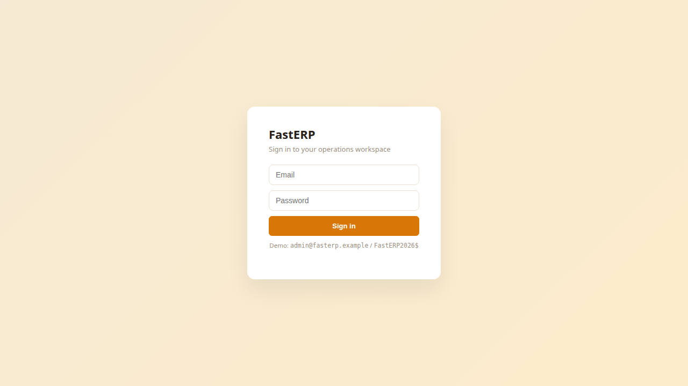

**Sell, ship, invoice, get paid — and keep balanced books.**

Self-contained synthetic demonstration · No Intuit connection

:::

---

::: toc

# Contents

The guide is organised into six parts. Each part opens with a short divider page,
then walks one workflow per screen.

Part 1 · Getting started

- [Operations dashboard](#operations-dashboard)

Part 2 · Selling — order to cash

- [Sales orders](#sales-orders)
- [Order-to-cash workflow](#order-to-cash-workflow)
- [Invoices and receivables](#invoices-and-receivables)

Part 3 · Buying — procure to stock

- [Suppliers](#suppliers)
- [Purchase order and goods receipt](#purchase-order-and-goods-receipt)

Part 4 · Inventory and warehouse

- [Items and stock](#items-and-stock)
- [Warehouse control tower](#warehouse-control-tower)
- [Stock by lot and FEFO](#stock-by-lot-and-fefo)
- [Stock movements](#stock-movements)
- [Cold-chain and temperature](#cold-chain-and-temperature)
- [Storage locations](#storage-locations)
- [Warehouse query lab](#warehouse-query-lab)

Part 5 · Accounting

- [Accounting overview](#accounting-overview)
- [Chart of accounts](#chart-of-accounts)
- [Record an expense](#record-an-expense)
- [Post a journal entry](#post-a-journal-entry)
- [General ledger](#general-ledger)
- [Projects and business units](#projects-and-business-units)
- [Financial reports](#financial-reports)
- [Accounting setup and attachments](#accounting-setup-and-attachments)

Part 6 · Integration

- [Integration API and Swagger](#integration-api-and-swagger)

:::

---

::: divider

Part 1

# Getting started

Sign in and read the daily cockpit. Every figure on the dashboard is derived from
the posted, synthetic transactions you will explore in the rest of the guide.

:::

---

## Operations dashboard {#operations-dashboard}

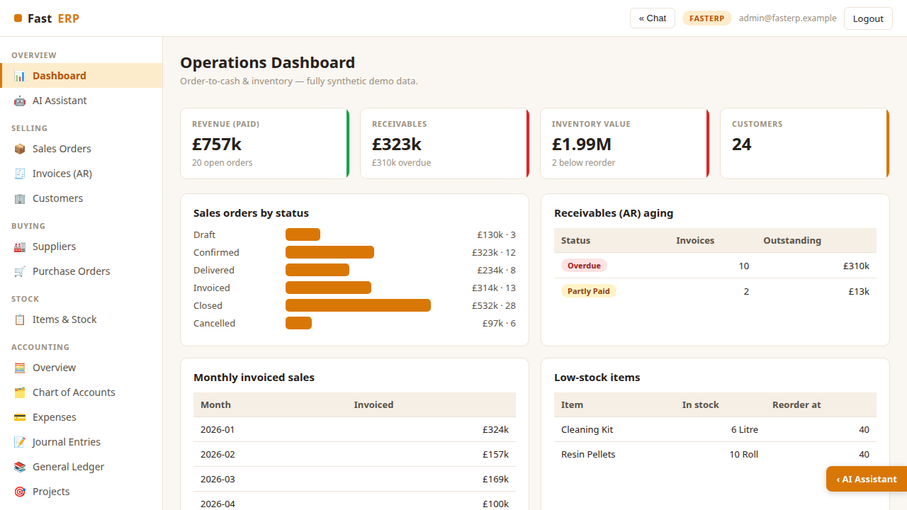

Start at the daily cockpit for paid revenue, receivables, inventory value and
open orders. The charts highlight order status, aging debt and low-stock items.
Collapse the AI rail whenever you need a wider working area.

---

::: divider

Part 2

# Selling — order to cash

Confirm demand, ship it against stock, raise the invoice, and clear the
receivable when the customer pays. Each step posts its own balanced entries.

:::

---

## Sales orders {#sales-orders}

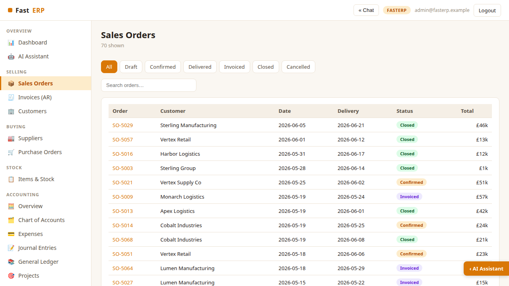

Open **Selling → Sales Orders** to filter the order book by status or search for
a customer or reference. Each row exposes delivery timing, workflow state and
total value.

---

## Order-to-cash workflow {#order-to-cash-workflow}

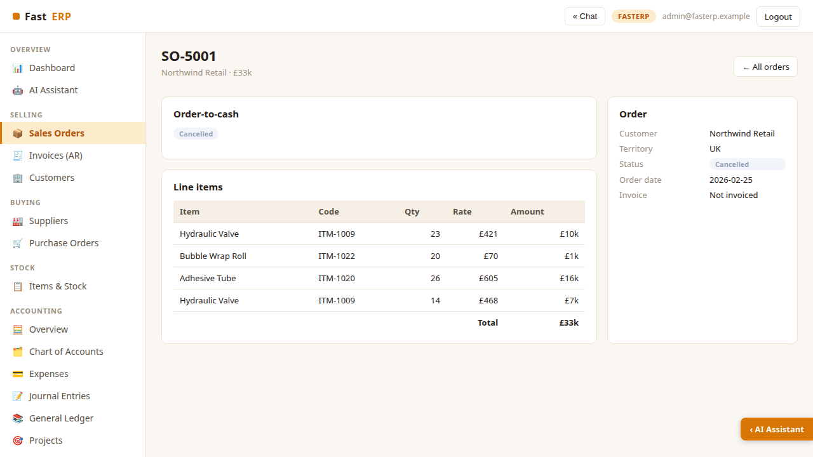

An order detail page combines customer data, line items, totals and the next
transactional action. Move eligible orders through Confirm, Deliver and Invoice;
delivery adjusts stock and invoicing creates balanced accounting entries.

---

## Invoices and receivables {#invoices-and-receivables}

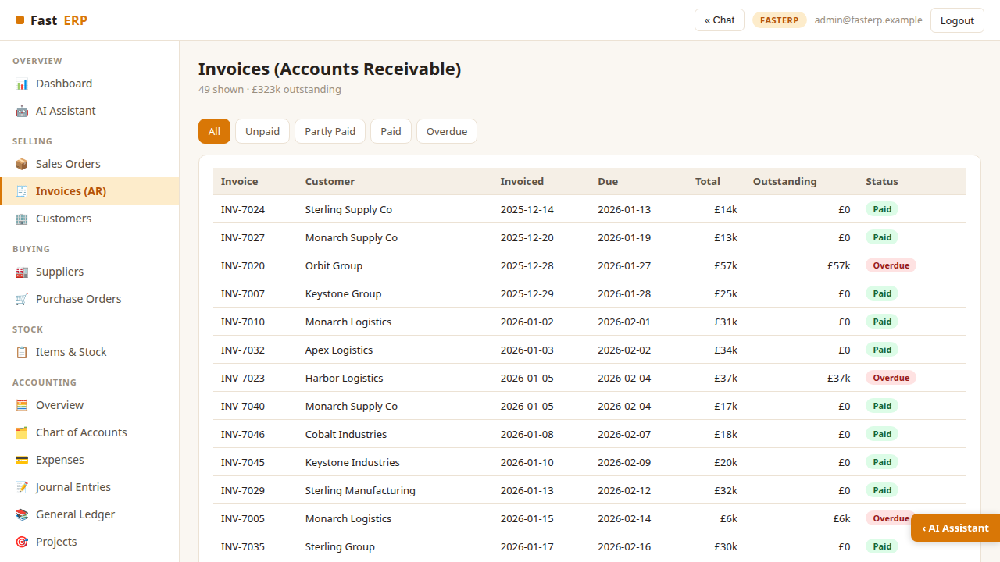

Use **Invoices (AR)** to review outstanding, partly paid, paid and overdue
invoices. Record a payment from an order or invoice workflow to clear Accounts
Receivable and increase Cash.

---

::: divider

Part 3

# Buying — procure to stock

Register suppliers, raise purchase orders, and receive goods. Goods receipt
increases stock and posts Inventory against Accounts Payable.

:::

---

## Suppliers {#suppliers}

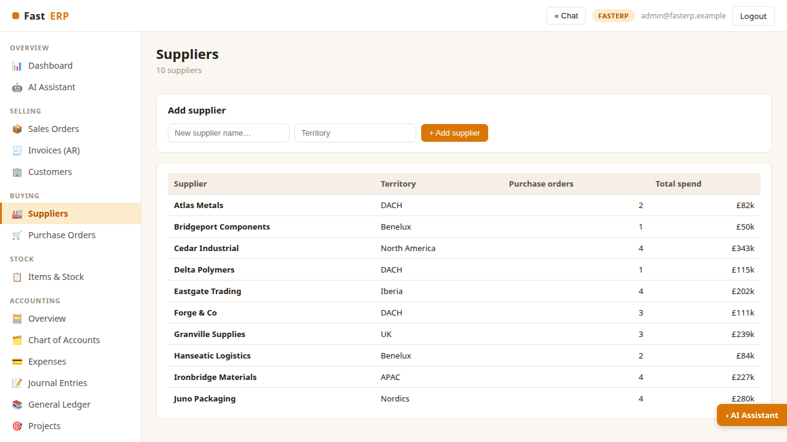

The supplier register summarizes territory, purchase-order count and total
spend. Add synthetic suppliers here before creating a purchasing transaction.

---

## Purchase order and goods receipt {#purchase-order-and-goods-receipt}

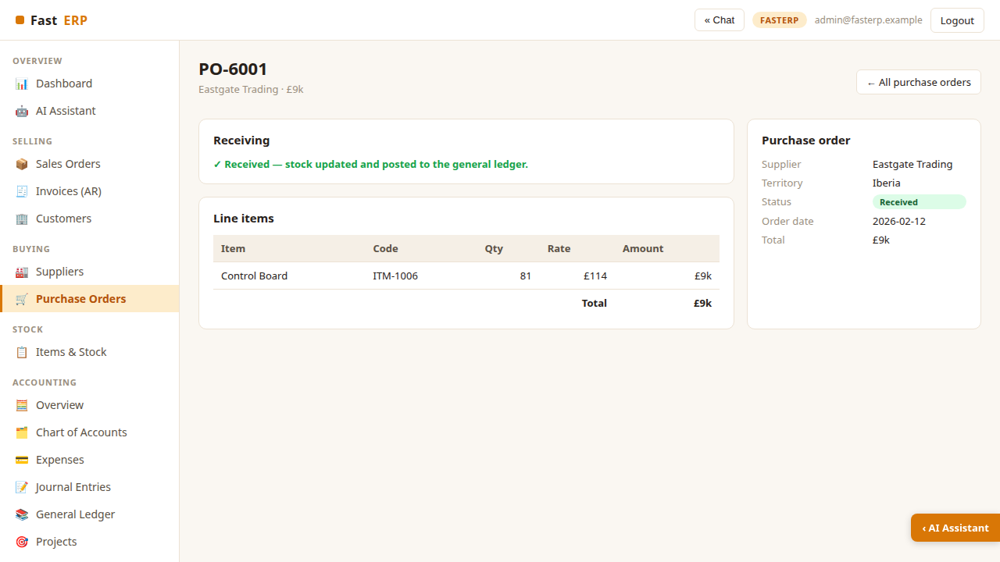

A purchase order records supplier, line items and workflow status. Receiving an
ordered PO increases stock and posts Inventory against Accounts Payable, linking
procurement to the general ledger.

---

::: divider

Part 4

# Inventory and warehouse

The item catalogue holds valuation and reorder policy; the warehouse workspace
tracks the physical stock behind it — lots, expiry, locations, cold chain and
FEFO allocation — with a guarded query lab for ad-hoc questions.

:::

---

## Items and stock {#items-and-stock}

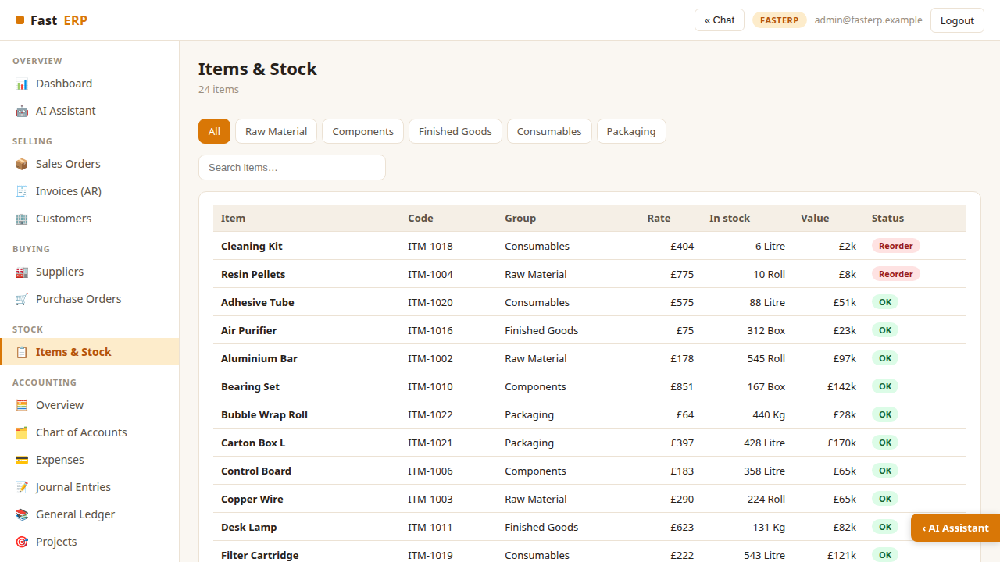

The stock register shows item codes, groups, selling rates, quantities, values
and reorder status. Filter by item group or search the catalog to investigate
availability before confirming demand.

---

## Warehouse control tower {#warehouse-control-tower}

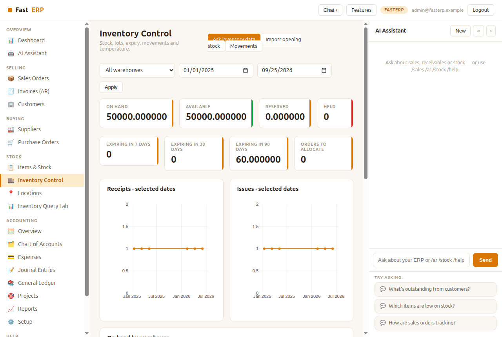

Open **Warehouse** for the physical-stock cockpit: on-hand versus available and
held quantities, recent movement volume, lots nearing expiry and any open
temperature excursions. It reads tenant-scoped reporting views, so the numbers
match what pickers and auditors see.

---

## Stock by lot and FEFO {#stock-by-lot-and-fefo}

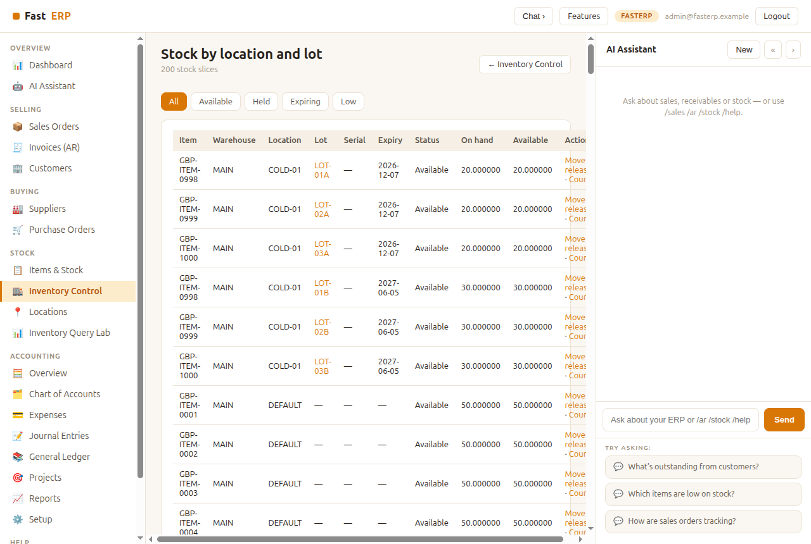

Every unit of physical stock is a slice keyed by item, warehouse, location, lot
and disposition. Batch-tracked items carry a lot code and expiry; allocation
follows **FEFO** — first-expiry, first-out — and respects each customer's minimum
remaining shelf life before a lot is eligible to ship.

---

## Stock movements {#stock-movements}

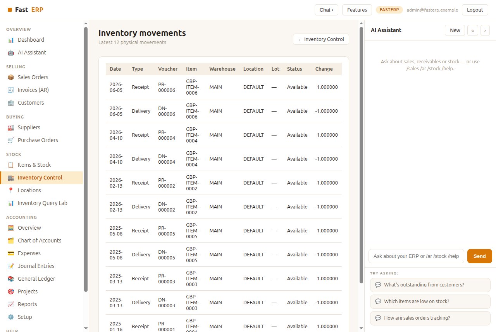

The movement ledger records every receipt, delivery, transfer and adjustment
with its lot and location. Filter by warehouse to trace how a balance was built,
then open a lot to follow it back to the receipt that created it.

---

## Cold-chain and temperature {#cold-chain-and-temperature}

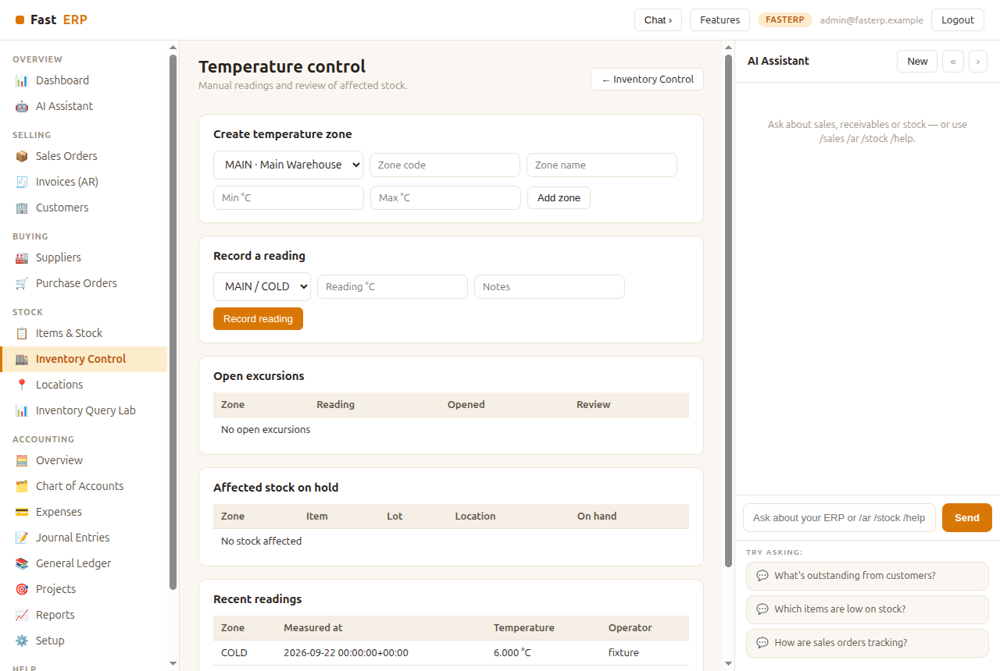

Refrigerated zones define an allowed band and a reading cadence. Logged readings
outside the band raise an excursion that automatically holds the affected stock
from allocation until an authorised release clears it.

---

## Storage locations {#storage-locations}

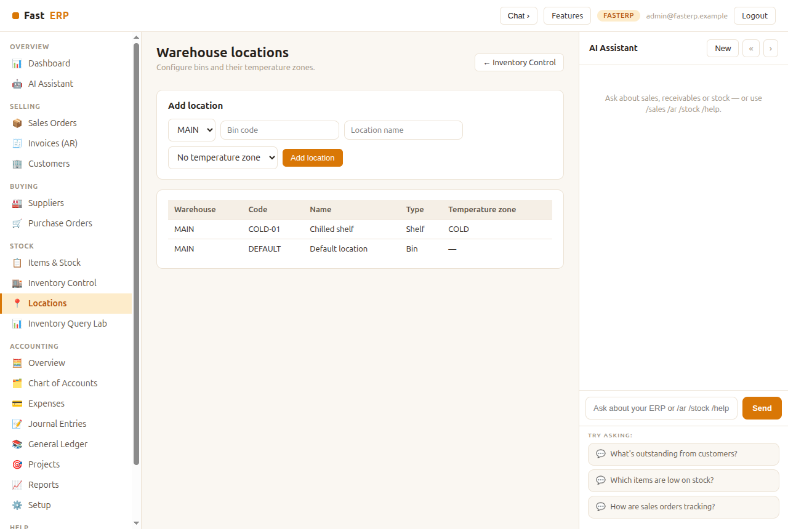

Locations model the physical layout — bins, shelves and zones — and control
whether stock in them is pickable. Assign a location to a temperature zone to
bring its contents under cold-chain monitoring, or transfer slices between
locations and warehouses as goods move.

---

## Warehouse query lab {#warehouse-query-lab}

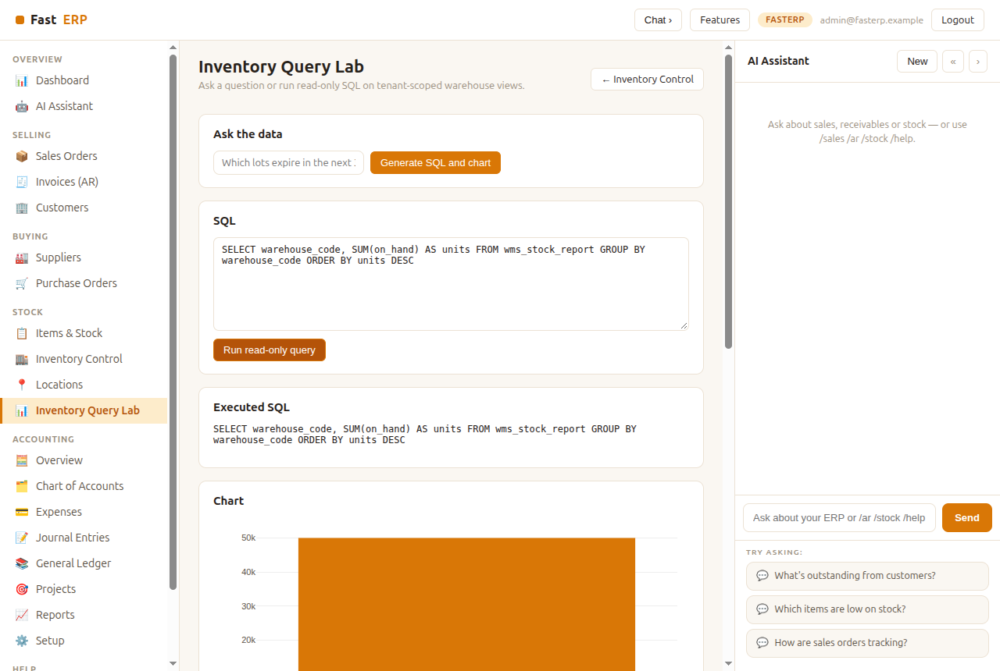

Ask an operational question in plain language, or write SQL directly. The lab
generates read-only `SELECT`s over the warehouse reporting views only — a parser
rejects writes, joins outside the views and unsafe functions — so analysts can
explore stock, movements, lots and temperature without risk to live data.

---

::: divider

Part 5

# Accounting

Operational events already posted the books. Here you review the results, add
manual expenses and journals, and run the statutory reports.

:::

---

## Accounting overview {#accounting-overview}

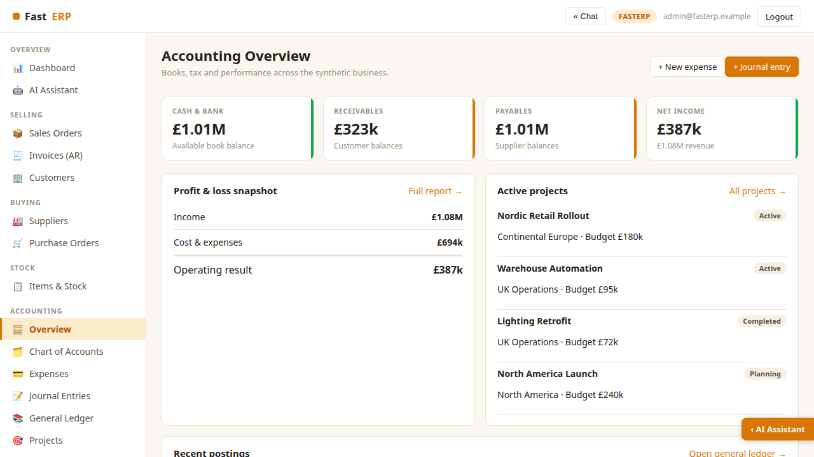

Open **Accounting → Overview** for cash, receivables, payables and net income.
Review the Profit & Loss snapshot, active projects and latest postings, or start
a new expense or manual journal.

---

## Chart of accounts {#chart-of-accounts}

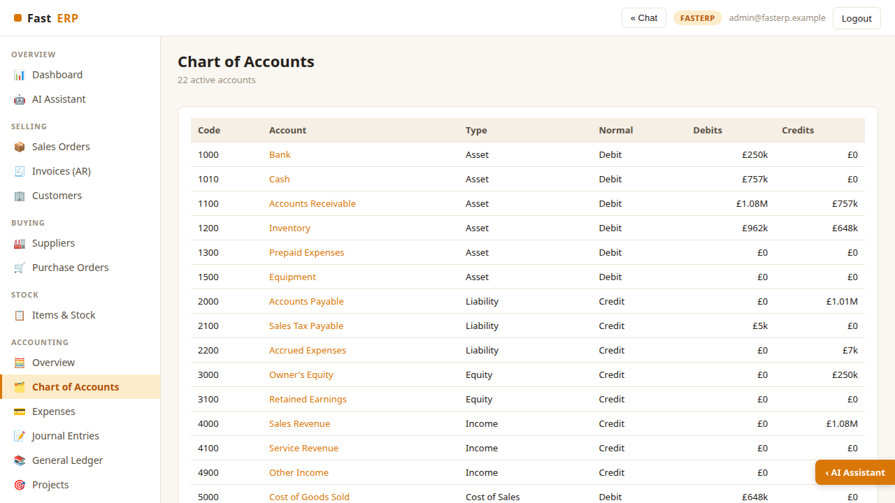

The 22-account chart groups assets, liabilities, equity, income, cost of sales
and operating expenses. Select an account to trace its postings in the General
Ledger.

---

## Record an expense {#record-an-expense}

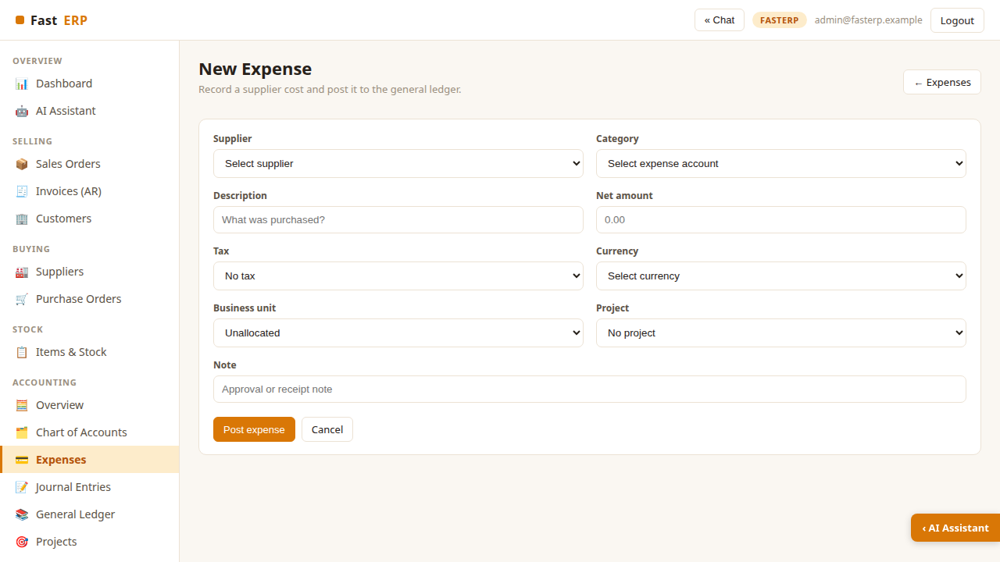

Choose a supplier and expense category, then enter the net amount, tax code and
currency. Optional business-unit and project dimensions flow to ledger lines and
profitability reporting. A note can retain approval or receipt context.

---

## Post a journal entry {#post-a-journal-entry}

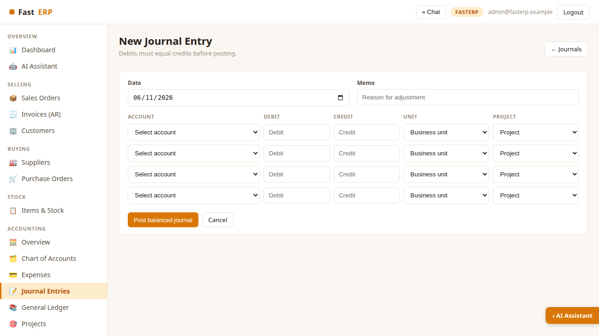

Enter a date and memo, then add at least two account lines. Each line may carry a
business unit and project. FastERP rejects the journal unless total debits equal
total credits.

---

## General ledger {#general-ledger}

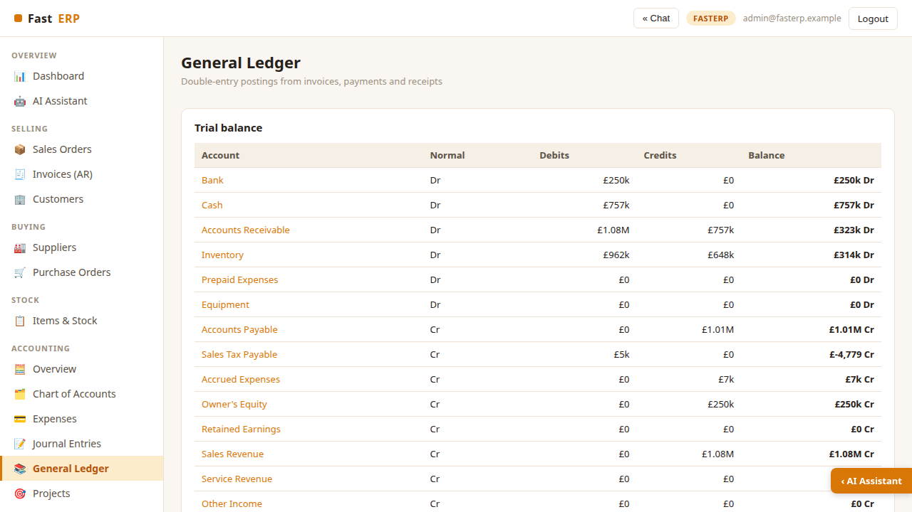

The Trial Balance summarizes debits, credits and normal-side balances. Filter
ledger entries by account and use shared references such as `INV-7042`,
`EXP-8001` and `JE-9001` to follow linked transactions.

---

## Projects and business units {#projects-and-business-units}

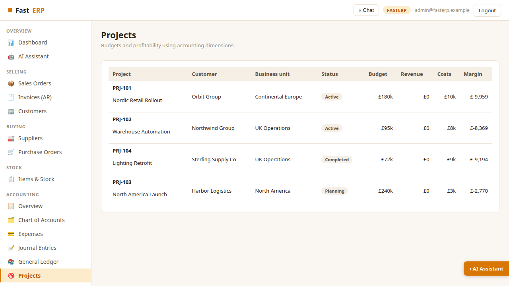

Projects combine customer, owning business unit, status, budget, revenue, costs
and margin. Dimensioned expenses and journals update project costs immediately
without requiring separate ledgers.

---

## Financial reports {#financial-reports}

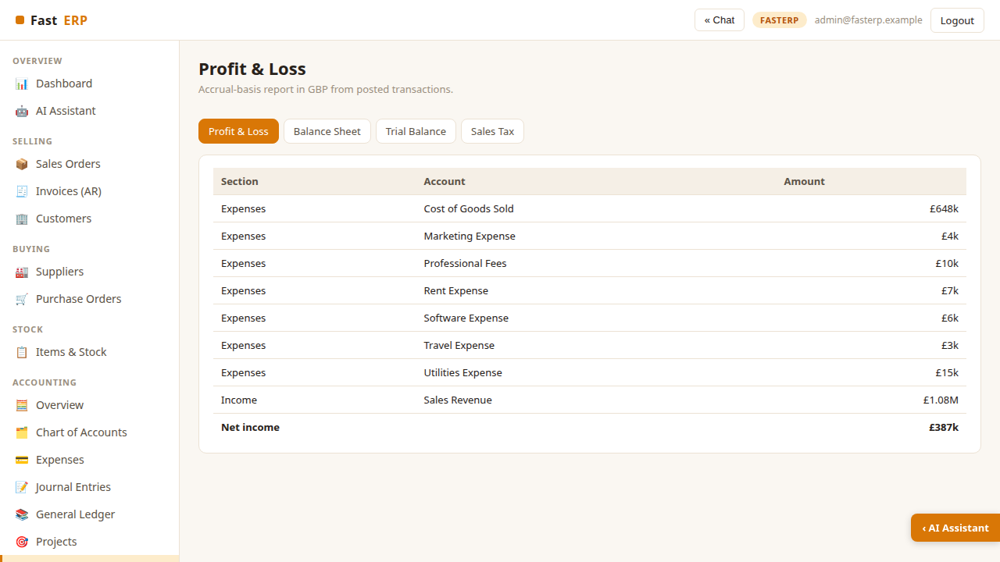

Switch between Profit & Loss, Balance Sheet, Trial Balance and Sales Tax. Reports
are accrual-basis, presented in GBP and derived solely from posted double-entry
transactions.

---

## Accounting setup and attachments {#accounting-setup-and-attachments}

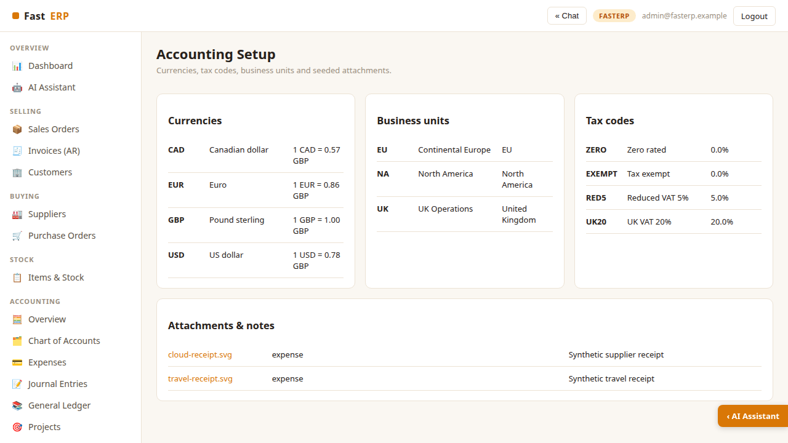

Setup lists GBP, EUR, USD and CAD rates, tax codes, business units and synthetic
receipt attachments. The rates and tax treatment are illustrative; the receipt
images contain no real supplier or payment information.

---

::: divider

Part 6

# Integration

Everything in this guide is available over an HTTP API for downstream systems and
migration rehearsals.

:::

---

## Integration API and Swagger {#integration-api-and-swagger}

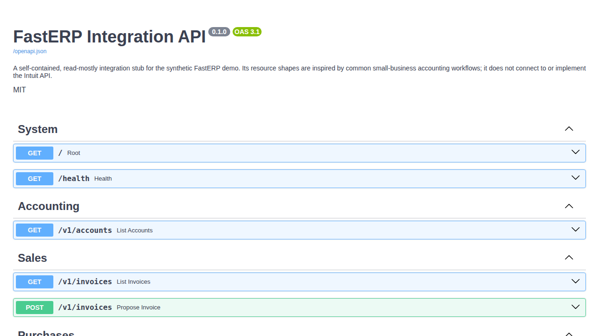

Run `.venv/bin/uvicorn api_app:app --port 5012` and open
`http://localhost:5012/docs`. The read-mostly FastAPI stub documents accounts,
invoices, expenses, projects, reports and webhook examples. Invoice POSTs
validate previews without posting to the books.
