::: cover

# FastERP kasutusjuhend

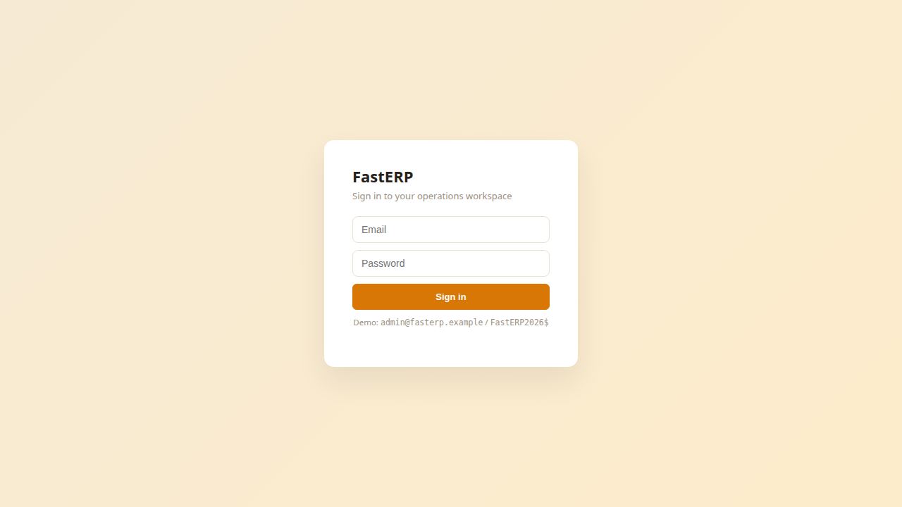

**Müü, tarni, esita arve, võta makse vastu — ja hoia raamatupidamine tasakaalus.**

Iseseisev sünteetiline näidis · Intuiti ühendust ei kasutata

:::

---

## Tegevuste töölaud

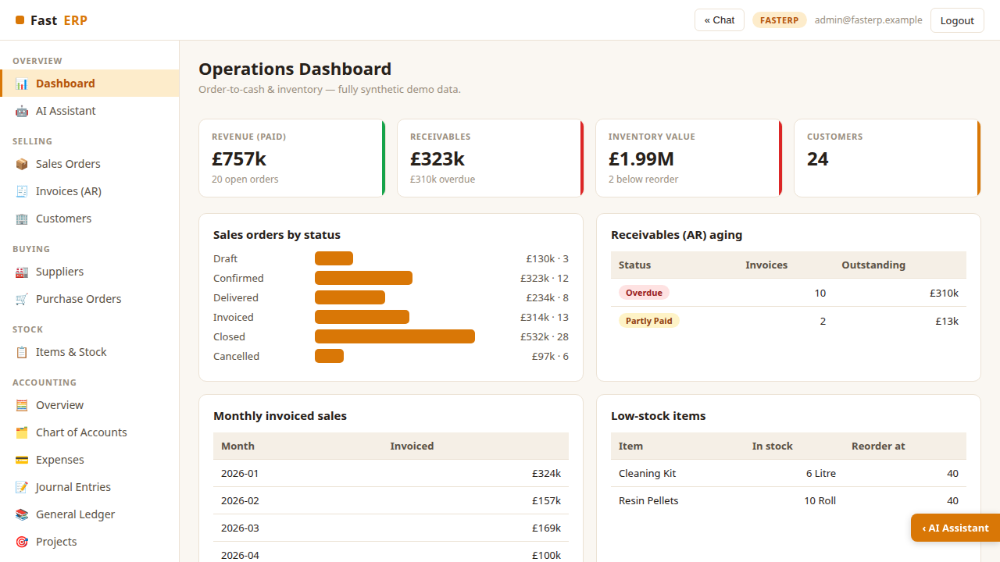

Igapäevane töölaud näitab laekunud müügitulu, nõudeid, laoväärtust ja avatud
tellimusi. Graafikud toovad esile tellimuste olekud, tähtaja ületanud nõuded ja
madala laoseisuga kaubad. Laiema tööala saamiseks saab AI-paneeli sulgeda.

---

## Müügitellimused

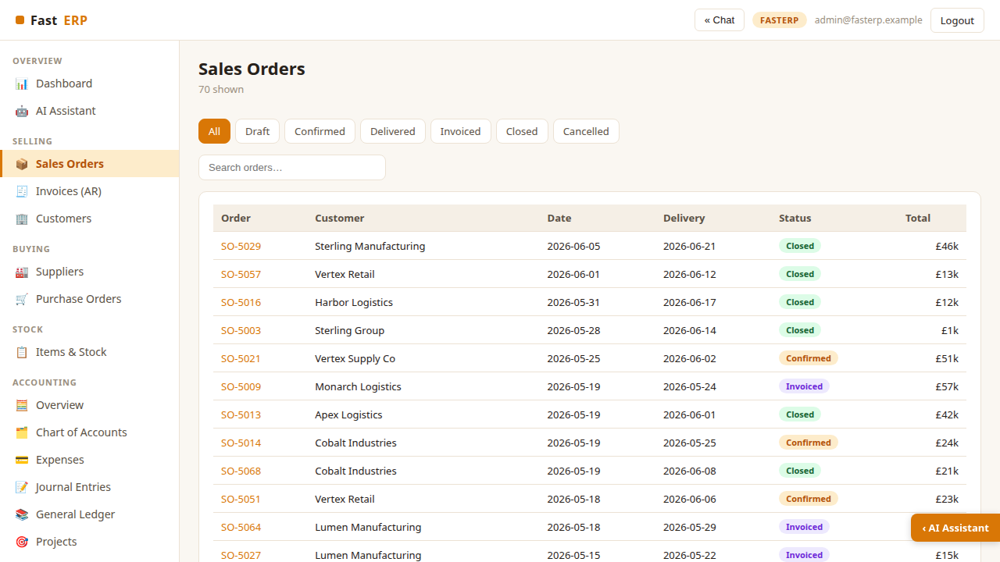

Ava **Selling → Sales Orders**, et filtreerida tellimusi oleku järgi või otsida
klienti ja viidet. Iga rida näitab tarneaega, töövoo olekut ja kogusummat.

---

## Tellimusest laekumiseni

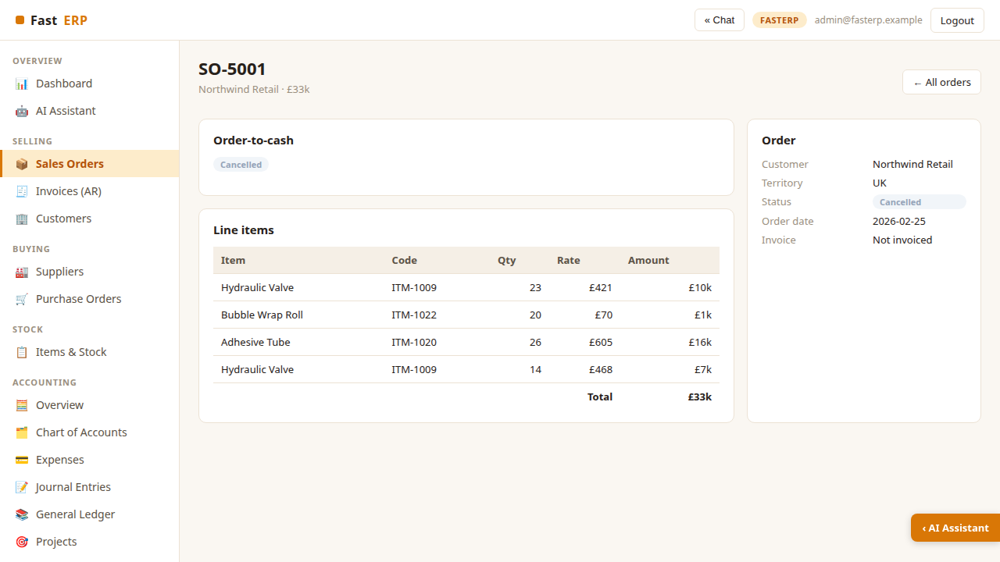

Tellimuse detailvaade koondab kliendi, read, summad ja järgmise tegevuse. Liiguta
sobiv tellimus läbi kinnitamise, tarnimise ja arveldamise. Tarnimine muudab
laoseisu ning arveldamine loob tasakaalus raamatupidamiskanded.

---

## Arved ja nõuded

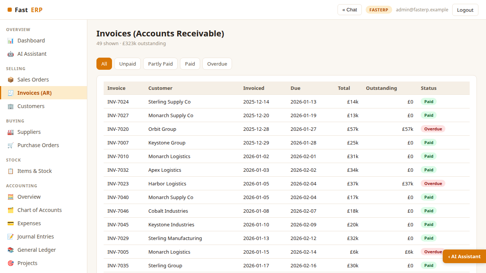

Vaates **Invoices (AR)** näed tasumata, osaliselt tasutud, tasutud ja tähtaja
ületanud arveid. Makse kajastamine vähendab ostjate nõudeid ja suurendab raha
kontot.

---

## Kaubad ja ladu

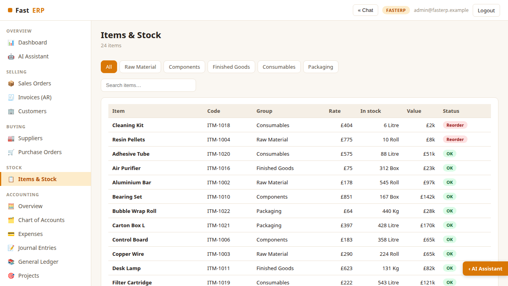

Laoregister näitab kaubakoode, rühmi, müügihindu, koguseid, väärtusi ja
juurdetellimise vajadust. Enne nõudluse kinnitamist filtreeri kaubarühma järgi
või otsi kataloogist saadavust.

---

## Tarnijad

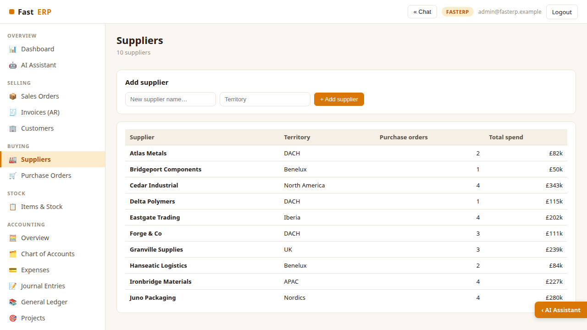

Tarnijate register võtab kokku piirkonna, ostutellimuste arvu ja kogukulu. Enne
ostutehingu loomist saab siin lisada sünteetilise tarnija.

---

## Ostutellimus ja kauba vastuvõtt

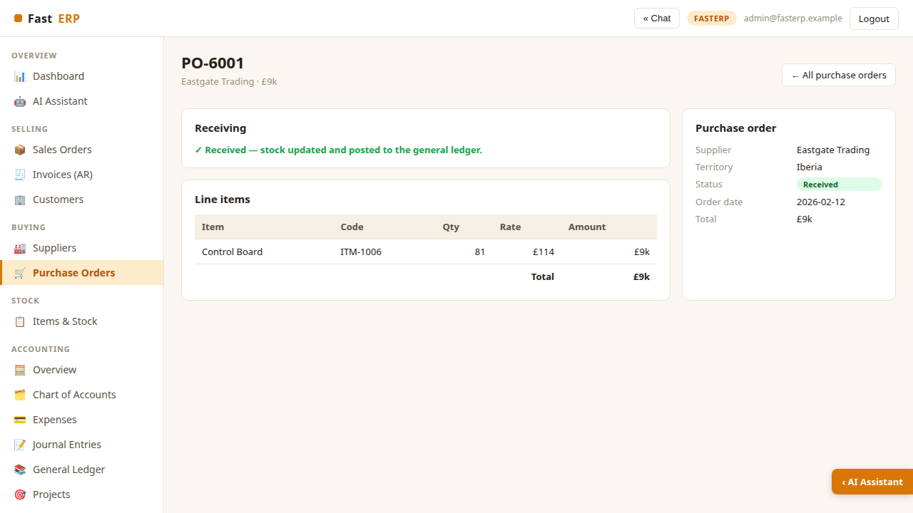

Ostutellimus sisaldab tarnijat, tellimusridu ja töövoo olekut. Tellitud kauba
vastuvõtmine suurendab laoseisu ning konteerib varud ostuvõlgade vastu, sidudes
hanke pearaamatuga.

---

## Raamatupidamise ülevaade

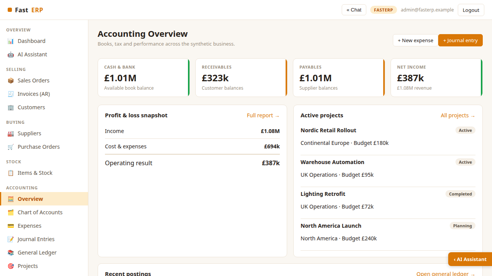

Ava **Accounting → Overview**, et näha raha, nõudeid, kohustusi ja puhaskasumit.
Vaata kasumiaruande kokkuvõtet, aktiivseid projekte ja viimaseid kandeid või loo
uus kulu või käsikandega päevaraamat.

---

## Kontoplaan

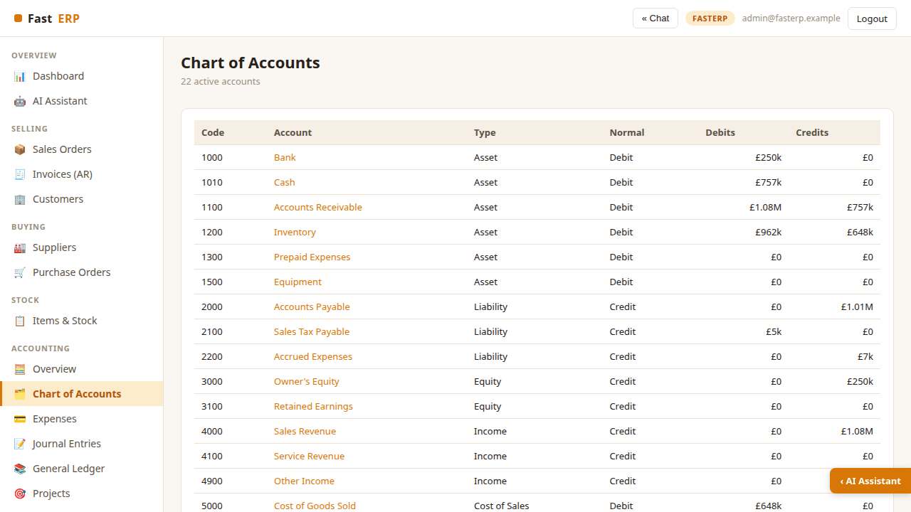

22 kontoga kontoplaan jaotab varad, kohustused, omakapitali, tulud, müüdud
kaupade kulu ja tegevuskulud. Konto valimisel saab selle kandeid pearaamatus
jälgida.

---

## Kulu kajastamine

Vali tarnija ja kulukonto ning sisesta netosumma, maksukood ja valuuta.
Äriüksuse ja projekti tunnused kanduvad pearaamatusse ja tasuvusaruandesse.
Märkusesse saab lisada kinnituse või kviitungi konteksti.

---

## Päevaraamatukande sisestamine

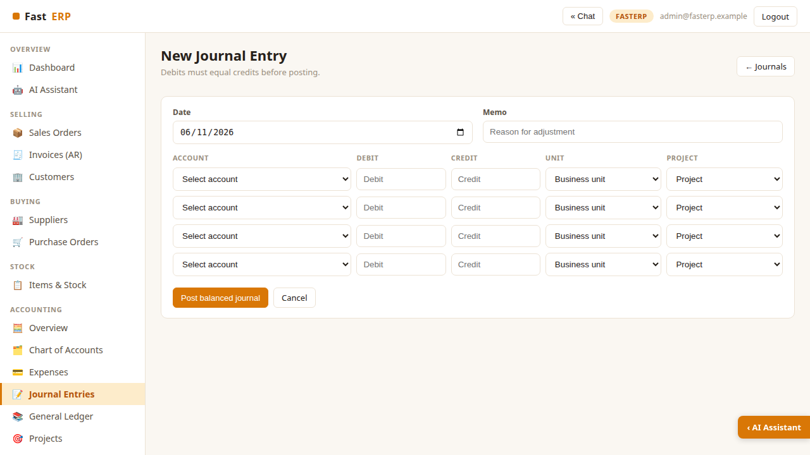

Sisesta kuupäev ja selgitus ning lisa vähemalt kaks kontorida. Igale reale saab
määrata äriüksuse ja projekti. FastERP lükkab kande tagasi, kui deebet ja kreedit
ei ole võrdsed.

---

## Pearaamat

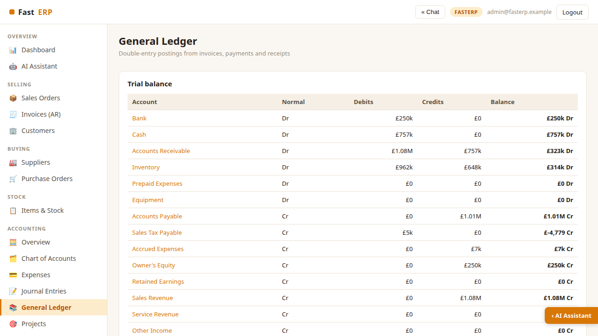

Proovibilanss võtab kokku deebeti, kreediti ja kontode lõppsaldod. Filtreeri
kandeid konto järgi ning kasuta seotud tehingute jälgimiseks ühiseid viiteid,
näiteks `INV-7042`, `EXP-8001` ja `JE-9001`.

---

## Projektid ja äriüksused

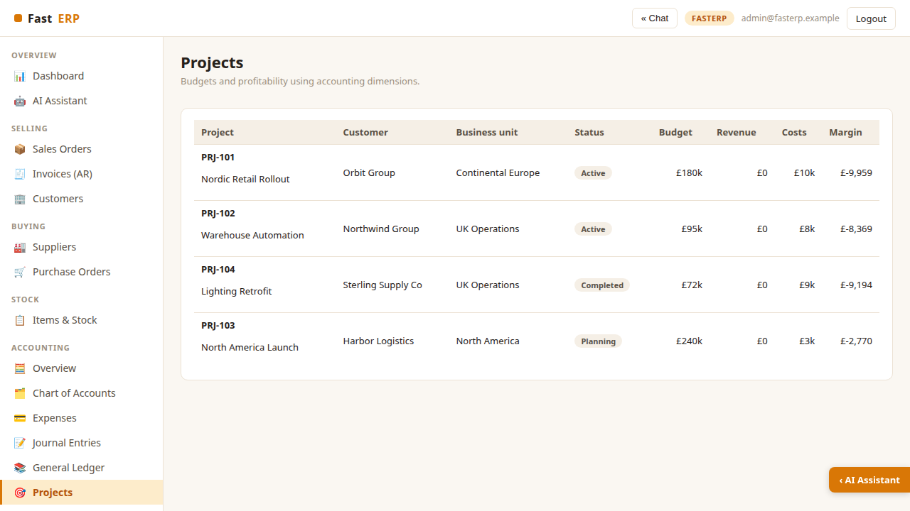

Projektivaade ühendab kliendi, vastutava äriüksuse, oleku, eelarve, tulud, kulud
ja marginaali. Tunnustega kulud ja päevaraamatukanded uuendavad projektikulu
kohe, ilma eraldi pearaamatuta.

---

## Finantsaruanded

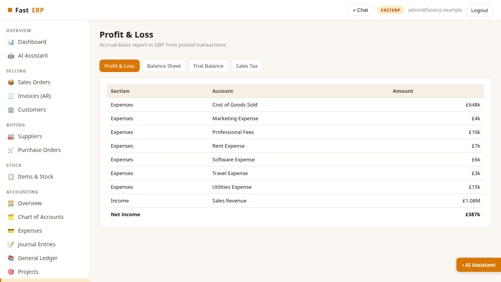

Valida saab kasumiaruande, bilansi, proovibilansi ja käibemaksu kokkuvõtte vahel.
Aruanded on tekkepõhised, esitatud naelsterlingites ja koostatud ainult
kinnitatud kahekordsetest kannetest.

---

## Raamatupidamise seadistus ja manused

Seadistus näitab GBP, EUR, USD ja CAD kursse, maksukoode, äriüksusi ning
sünteetilisi kviitungimanuseid. Kursid ja maksukäsitlus on näitlikud ning
kviitungipildid ei sisalda päris tarnija- ega makseandmeid.

---

## Integratsiooni API ja Swagger

Käivita `.venv/bin/uvicorn api_app:app --port 5012` ja ava
`http://localhost:5012/docs`. FastAPI lugemiseks mõeldud näidisliides kirjeldab
kontosid, arveid, kulusid, projekte, aruandeid ja veebikonksude näiteid. Arve
POST-päring kontrollib eelvaadet, kuid ei tee raamatupidamiskannet.
