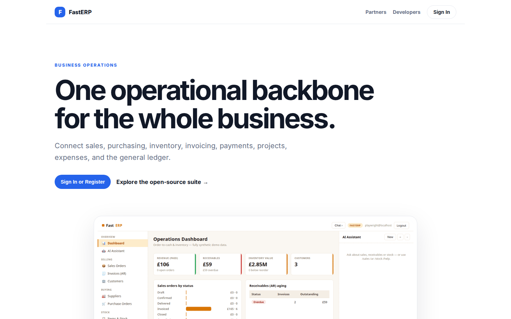
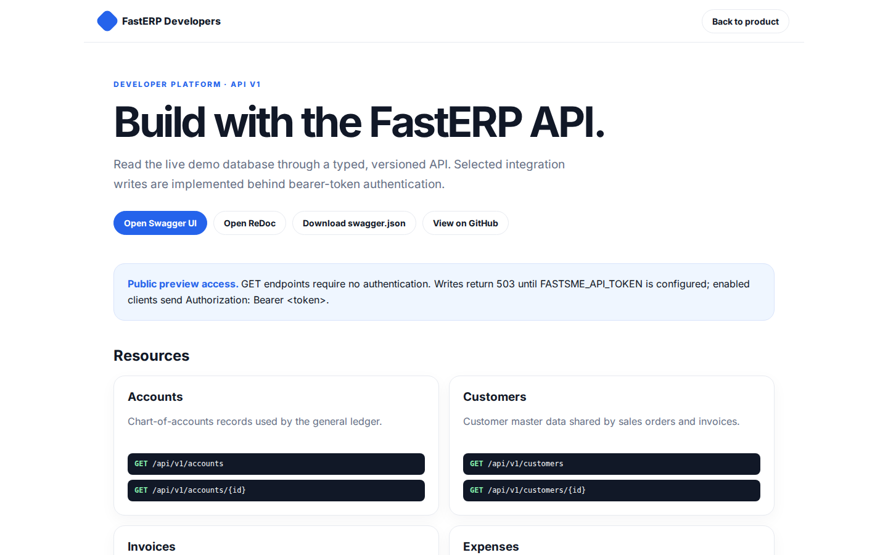

# FastERP Platform Guide

**Published:** 2026-08-19
**Platform:** [https://erp.fastsme.com](https://erp.fastsme.com)
**Source:** [github.com/predictivelabsai/FastERP](https://github.com/predictivelabsai/FastERP)

## Platform overview

**FastERP** is an open-source **ERP** built with — a server-side, HTMX-driven ERP with behavior informed by public ERP workflows and an independently designed Python/PostgreSQL implementation. It covers **Order-to-Cash, Procure-to-Stock, Inventory and Accounting** with deterministic synthetic data. Python-first, no Jav

This visual guide was reviewed against the live product using Playwright. Screens and available navigation can vary by account, role, and deployment configuration.

## 1. One operational backbone for the whole business.

BUSINESS OPERATIONS One operational backbone for the whole business. Connect sales, purchasing, inventory, invoicing, payments, projects, expenses, and the general ledger. Sign In or Register Explore the open-source suite → Product tour · see the workspace in

Screen reviewed at: [https://erp.fastsme.com/](https://erp.fastsme.com/)

## 2. Build with the FastERP API.

FastERP Developers Back to product DEVELOPER PLATFORM · API V1 Build with the FastERP API. Read the live demo database through a typed, versioned API. Selected integration writes are implemented behind bearer-token authentication. Open Swagger UI Open ReDoc Do

Screen reviewed at: [https://erp.fastsme.com/developers](https://erp.fastsme.com/developers)

## 3. Sign in

Sign in with Google Sign in to continue to fastsme.com Email or phone Forgot email? Next Create account Afrikaans azərbaycan bosanski català Čeština Cymraeg Dansk Deutsch eesti English (United Kingdom) English (United States) Español (España) Español (Latinoam

Screen reviewed at: [https://accounts.google.com/v3/signin/identifier?opparams=%253F&dsh=S1409831183%3A1787122704460483&access_type=online&client_id=887059023987-2a7spj1m82eivobdbt1itb3cqca6tpt1.apps.googleusercontent.com&o2v=2&prompt=select_account&redirect_uri=https%3A%2F%2Ferp.fastsme.com%2Fauth%2Fgoogle%2Fcallback&response_type=code&scope=openid+email+profile&service=lso&state=Db1FSGt9wBFsnB-aCQImEFfkpCS0_CuL5UKc9LXJ9ug&flowName=GeneralOAuthLite&continue=https%3A%2F%2Faccounts.google.com%2Fsignin%2Foauth%2Flegacy%2Fconsent%3Fauthuser%3Dunknown%26part%3DAJi8hAO6Px0ayy9V7kQIDqunZ_fn7-3G3FtolLDOkj2yVJZzG3H67HT1qemSROrQ_7DKjGIE0HW3UkE1oFNMyra0Jee6_BHYeqohu0eKJYXOOJ5orpfyivU3o_k6-89JR3e-2IggqWitxiT96W9YpNTUMWeijDiuqSr-aeZCkTrVn5T8K9xNYAMmXL_7t_lde2cDvSYTitXmOAUuNPEVJGjcrNhJn-oXy83FPhjLb6FWoXl3HfeCEgwTyC6FRoUZZmD_fS6jkP9TDE4miyuJ8R-RZ8ILYodpaMvNm6zaWBjLsbLH57_HLRjGWl3NK3FDH8gC4EUE5TD-rFijN0keKYcKDMY38l5-odwNfZ0UMZXcIkAmoTKXdP8gM1yupar7ap4BNmjK02W-Ji8YA0UvlGJdRm4F59f_j61N7eVwIk6jrG9T6eq8-n50ebSeqEqvXELoNdV0WgQx6jiDuTBNpcxAfHR60XUicw%26flowName%3DGeneralOAuthFlow%26as%3DS1409831183%253A1787122704460483%26client_id%3D887059023987-2a7spj1m82eivobdbt1itb3cqca6tpt1.apps.googleusercontent.com%23&app_domain=https%3A%2F%2Ferp.fastsme.com&rart=ANgoxcc5JDBMN8htPlMX71zQ4xKZpp5E9IdZXdWvIwJT5IF5AbG3k_DhKtMPTnORtuO_XepuKhQn2lQa5GJVxcEOpLJADevXTLUcW9ydFzBIHJD99U06_M8](https://accounts.google.com/v3/signin/identifier?opparams=%253F&dsh=S1409831183%3A1787122704460483&access_type=online&client_id=887059023987-2a7spj1m82eivobdbt1itb3cqca6tpt1.apps.googleusercontent.com&o2v=2&prompt=select_account&redirect_uri=https%3A%2F%2Ferp.fastsme.com%2Fauth%2Fgoogle%2Fcallback&response_type=code&scope=openid+email+profile&service=lso&state=Db1FSGt9wBFsnB-aCQImEFfkpCS0_CuL5UKc9LXJ9ug&flowName=GeneralOAuthLite&continue=https%3A%2F%2Faccounts.google.com%2Fsignin%2Foauth%2Flegacy%2Fconsent%3Fauthuser%3Dunknown%26part%3DAJi8hAO6Px0ayy9V7kQIDqunZ_fn7-3G3FtolLDOkj2yVJZzG3H67HT1qemSROrQ_7DKjGIE0HW3UkE1oFNMyra0Jee6_BHYeqohu0eKJYXOOJ5orpfyivU3o_k6-89JR3e-2IggqWitxiT96W9YpNTUMWeijDiuqSr-aeZCkTrVn5T8K9xNYAMmXL_7t_lde2cDvSYTitXmOAUuNPEVJGjcrNhJn-oXy83FPhjLb6FWoXl3HfeCEgwTyC6FRoUZZmD_fS6jkP9TDE4miyuJ8R-RZ8ILYodpaMvNm6zaWBjLsbLH57_HLRjGWl3NK3FDH8gC4EUE5TD-rFijN0keKYcKDMY38l5-odwNfZ0UMZXcIkAmoTKXdP8gM1yupar7ap4BNmjK02W-Ji8YA0UvlGJdRm4F59f_j61N7eVwIk6jrG9T6eq8-n50ebSeqEqvXELoNdV0WgQx6jiDuTBNpcxAfHR60XUicw%26flowName%3DGeneralOAuthFlow%26as%3DS1409831183%253A1787122704460483%26client_id%3D887059023987-2a7spj1m82eivobdbt1itb3cqca6tpt1.apps.googleusercontent.com%23&app_domain=https%3A%2F%2Ferp.fastsme.com&rart=ANgoxcc5JDBMN8htPlMX71zQ4xKZpp5E9IdZXdWvIwJT5IF5AbG3k_DhKtMPTnORtuO_XepuKhQn2lQa5GJVxcEOpLJADevXTLUcW9ydFzBIHJD99U06_M8)

## Getting started

Visit [https://erp.fastsme.com](https://erp.fastsme.com) to explore FastERP. For source code and deployment details, use the GitHub link above.
